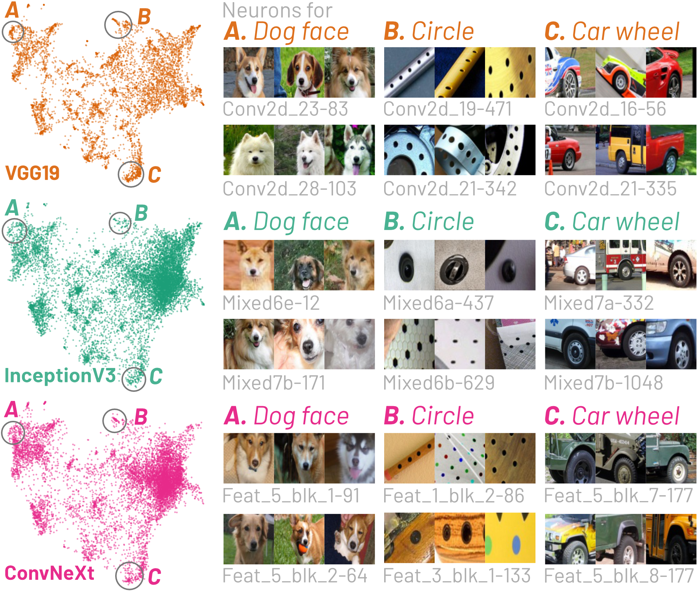
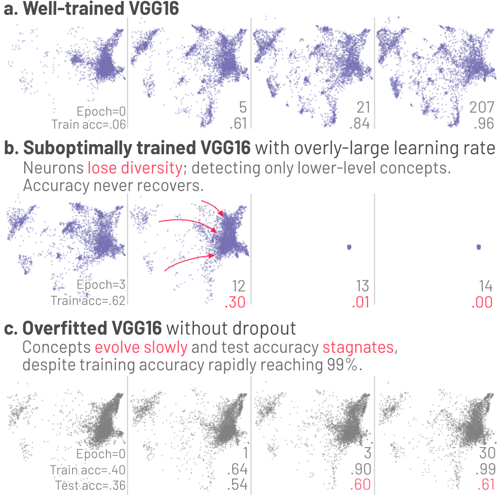

# ConceptEvo
ConceptEvo is a unified interpretation framework that reveals the inception and evolution of concepts during DNN training. For detialed insights behind ConceptEvo, refer to the 📄[ConceptEvo paper](https://arxiv.org/abs/2203.16475).

## About ConceptEvo
ConceptEvo generates a **unified semantic space** that enables side-by-side comparison of different models during training. This space is a visual and analytic tool that facilitates a deeper understanding of how models evolve and learn.

### Unified Semantic Space in ConceptEvo

This visualization represents concepts from various models in a single, cohesive space. By embedding and aligning neurons (depicted as dots), ConceptEvo maps similar concepts (such as a dog's face, a circle, or a car wheel) to corresponding locations, allowing for an intuitive comparison of different models.

### ConceptEvo in Action: Identifying Training Issues

ConceptEvo's unified semantic space isn't just a visualization tool; it's also a powerful diagnostic instrument. It allows for the identification of potential issues in the training process by juxtaposing a well-trained model against one that is sub-optimally trained. 

- (a) **A well-trained VGG16** shows gradual concept formations and refinements. 
- (b) **A suboptimally trained VGG16** with a large learning rate rapidly loses the ability to detect most concepts. 
- (c) **An overfitted VGG16** without dropout layers shows slow concept evolutions despite rapid training accuracy increases. 

## Installation
Before diving into ConceptEvo, ensure you have the necessary packages. Installation is a breeze with [pip](https://pip.pypa.io/en/stable/), Python's preferred package manager. 

Open your terminal and execute the following command:
```shell
pip install -r requirements.txt
```
This will automatically install all the required packages listed in `requirements.txt`.

## Usage
To make the most out of ConceptEvo, follow these guidelines:
- **Access Sample Scripts**: Navigate to the `./scripts` directory. Here, you'll find a collection of sample scripts demonstrating various functionalities of ConceptEvo.

- **Execute Scripts**: To run these scripts, move to the `./src` directory in your terminal and execute the desired script. 

## Credits
ConceptEvo was created by Haekyu Park, Seongmin Lee, Benjamin Hoover, Austin P. Wright, Omar Shaikh, Rahul Duggal, Nilaksh Das, Kevin Li, Judy Hoffman, and Duen Horng (Polo) Chau.

## License
ConceptEvo is open-sourced under the [MIT License](https://choosealicense.com/licenses/mit/). 

## Contact
Encountering issues or have queries? We encourage you to:

- **Open an Issue**: For technical problems or feature suggestions, feel free to open an issue on our GitHub repository.

- **Reach Out to the Authors**: For more in-depth questions or discussions, feel free to contact the authors directly. The contact information is available in [Authors.md](./Authors.md).

## Citation
If you find ConceptEvo useful in your research, please consider citing our paper! Here is the BibTeX entry for your convenience:

```bibtex
@article{park2023conceptevo,
  title={Concept Evolution in Deep Learning Training: A Unified Interpretation Framework and Discoveries},
  author={Park, Haekyu and Lee, Seongmin and Hoover, Benjamin and Wright, Austin P and Shaikh, Omar and Duggal, Rahul and Das, Nilaksh and Li, Kevin and Hoffman, Judy and Chau, Duen Horng},
  booktitle = {International Conference on Information and Knowledge Management (CIKM)},
  year = {2023}
}
```
